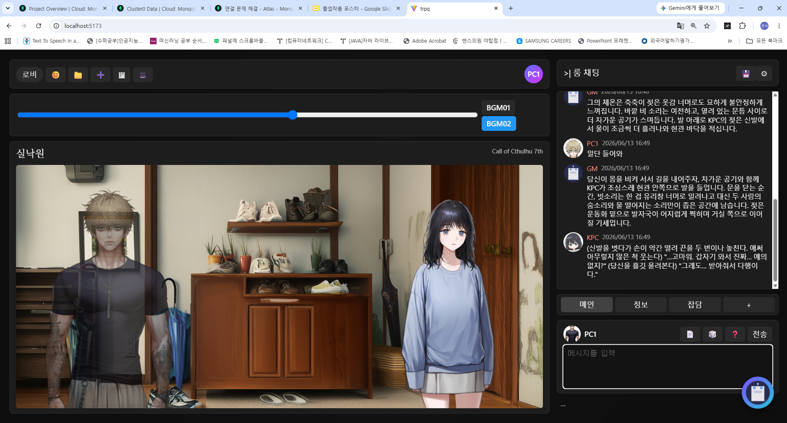
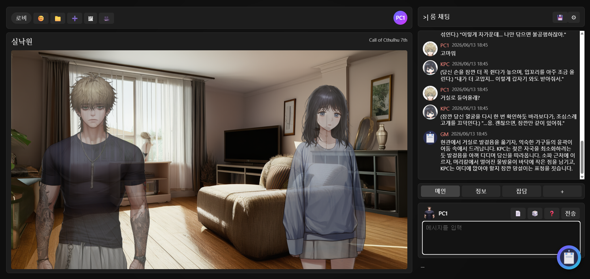

<div align="center">

# 🎲 Better GM Than Yours

**API 기반 자동화 TRPG 세션 진행 서비스**  
*CoC 7판 기반 1:1 텍스트 세션을, 언제든 시작하고 “완결”까지 도달하도록 설계한 TRPG 전용 진행 엔진*

<br/>

<!-- 선택: 배지(원하는 것만 남겨도 됨) -->


<br/>

</div>

---
# Better GM Than Yours

> AI가 GM과 KPC를 동시에 수행하는 TRPG 세션 자동화 플랫폼
> 룰북 RAG, 시나리오 진행, 캐릭터 페르소나, 주사위 판정, 비주얼 노벨형 UI를 결합한 AI-GM 프로젝트입니다.

<br />

## Final Report

프로젝트의 전체 기획, 구현 구조, 기술 설명, 데모 UI, 창업 플랜, 멘토링 피드백은 아래 최종 결과 보고서에서 확인할 수 있습니다.

[View Final Report](https://minju5054.github.io/GraduationPJ-TRPG/)

<br />

## Project Overview

**Better GM Than Yours**는 TRPG(Tabletop Role-Playing Game)에서 가장 큰 부담이 되는 GM(Game Master) 역할을 AI로 자동화하는 프로젝트입니다.

기존의 일반 챗봇은 자유로운 대화는 가능하지만, TRPG 세션에 필요한 룰 기반 판정, 장면 진행, 캐릭터 반응, 세션 상태 관리가 불안정합니다. 본 프로젝트는 LLM을 단순 대화 상대가 아니라 **TRPG 세션을 진행하는 AI-GM 엔진**으로 설계했습니다.

AI-GM은 사용자의 행동 입력을 바탕으로 현재 장면을 해석하고, 룰북 RAG와 캐릭터 데이터를 참고해 GM 서술, KPC 대사, 주사위 판정 결과를 생성합니다. 또한 배경 이미지와 캐릭터 스탠딩 이미지를 결합해 텍스트 중심 세션을 비주얼 노벨형 UI로 확장했습니다.

<br />

## Demo UI



<br />

## Key Features

### AI-GM Session Engine

* GM 없이 TRPG 세션 진행
* 사용자 입력에 따른 장면 묘사와 사건 전개
* KPC 대사 및 반응 자동 생성
* 세션 로그와 진행 상태 관리
* 섹션 종료 조건 감지 및 다음 장면 연결

### Rulebook-Based RAG

* Call of Cthulhu 7th Edition 룰북 기반 검색
* 판정 의도가 포함된 사용자 행동을 쿼리로 변환
* 관련 룰 조항 검색 후 판정 근거로 활용
* 성공 / 실패 / Hard Success / Extreme Success 판정 반영

### Character Persona System

* PC / KPC 정보 관리
* persona.json 기반 캐릭터 성격 구성
* Big Five 성격 수치, 관계 정보, 신념, 말투 반영
* KPC의 일관된 대화와 행동 생성

### Visual Novel-Style UI

* 시나리오 장소별 배경 이미지 표시
* 캐릭터 스탠딩 이미지를 배경 위에 합성
* 말하는 캐릭터는 전면 강조
* 말하지 않는 캐릭터는 dim 처리
* 채팅 로그에 캐릭터 초상화 기반 프로필 표시

### Image Layer

* 정적 배경 이미지 생성
* 캐릭터 초상화 생성
* `[장소: X]` 태그 기반 배경 전환
* 생성된 이미지 자산을 세션 UI와 연결

<br />

## System Architecture



<br />

## Core Flow

```text
User Input
   ↓
AI-GM Session Loop
   ↓
Context Builder
   ↓
Rulebook / Scenario / Character Retrieval
   ↓
LLM Generation
   ↓
Dice & Rule Judgment
   ↓
GM Narrative + KPC Dialogue
   ↓
Text + Image Session Output
```

<br />

## Tech Stack

| Area        | Stack                                             |
| ----------- | ------------------------------------------------- |
| Back-End    | FastAPI                                           |
| Database    | MongoDB                                           |
| AI          | LLM + Custom RAG                                  |
| Rule System | Call of Cthulhu 7th Edition                       |
| Image       | Static Background / Character Portrait Generation |
| Front-End   | Visual Novel-style Session UI                     |
| Report Page | HTML / CSS / GitHub Pages                         |

<br />

## Directory Structure

```text
GraduationPJ-TRPG/
├── TRPG/                         # React + Vite 기반 프론트엔드
│   ├── public/
│   │   └── vite.svg
│   ├── src/
│   │   ├── assets/
│   │   ├── data/
│   │   ├── App.css
│   │   ├── App.jsx
│   │   ├── index.css
│   │   └── main.jsx
│   ├── .gitignore
│   ├── README.md
│   ├── eslint.config.js
│   ├── index.html
│   ├── package-lock.json
│   ├── package.json
│   └── vite.config.js
│
├── database/                     # MongoDB 연동 및 stat DB 처리
│   ├── database.py
│   └── database_stat.py
│
├── docs/                         # GitHub Pages용 최종 결과 보고서
│   ├── BetterGMThanYours_readable_assets/
│   ├── index.html
│   └── style_pdf_safe_redesign.css
│
├── generated_assets/             # 생성된 이미지 자산
│   ├── backgrouds/
│   ├── characters/
│   └── sds/
│
├── models/                       # 페르소나 및 프롬프트 구성 모델
│   ├── persona.py
│   ├── persona_prompt.py
│   ├── prompt_base.py
│   └── type_model.py
│
├── prompts/                      # 세션 진행용 프롬프트 / 시나리오 데이터
│   ├── chat_history.json
│   ├── full_system_prompt.txt
│   ├── persona.json
│   ├── persona_AQ.json
│   ├── print_formatting_guide.txt
│   ├── scenario_secret.txt
│   ├── scene_public1.txt
│   ├── scene_public2.txt
│   ├── scene_public3.txt
│   ├── scene_public4.txt
│   ├── scene_public5.txt
│   ├── scene_public6.txt
│   ├── scene_public7.txt
│   └── trpg_rules.txt
│
├── services/                     # LLM, RAG, 판정, 프롬프트 서비스
│   ├── chat_openai.py
│   ├── judge.py
│   ├── prompt_service.py
│   └── rag.py
│
├── .env.example
├── .gitignore
├── CHANGES.md
├── README.md
├── Retrieval.py                  # RAG 검색 / retrieval 실행 로직
├── chain.py                      # LLM 체인 실행 로직
└── main.py                       # FastAPI 백엔드 진입점
```

<br />

## Project Pages

* [Final Report](https://minju5054.github.io/GraduationPJ-TRPG/)
* [Repository](https://github.com/minju5054/GraduationPJ-TRPG)

<br />

## Project Period

2026.03.03 - 2026.06.30

<br />

## Team

**4조 밥사조**

<br />

## Project Goal

본 프로젝트의 목표는 LLM을 활용해 “그럴듯한 대화”를 만드는 것이 아니라, TRPG 세션에 필요한 **룰, 판정, 캐릭터 반응, 장면 진행, 시각적 출력**을 하나의 실행 루프로 통합하는 것입니다.

이를 통해 사용자는 사람 GM 없이도 언제든 시나리오 기반 TRPG 세션을 시작하고, AI-GM과 KPC가 반응하는 몰입형 세션을 경험할 수 있습니다.
